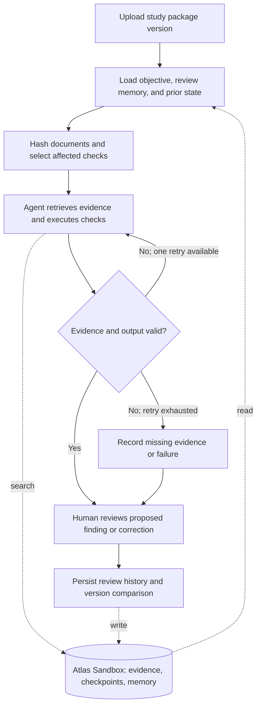

# SubmissionAI: revised solo hackathon plan

Updated September 26, 2026 after reading the participant guide supplied by the user. This replaces the earlier proposal based only on the public event page. This file preserves the planning record. Implementation has since been added to this workspace; see [README.md](README.md) for current capabilities, validation, and remaining live-service setup.

## 1. Rules that determine your entry

Source: the participant guide supplied by the project owner, available to registered participants through the [event details page](https://cerebralvalley.ai/e/mongodb-nyc-hackathon/details). The guide is more specific than the [public event page](https://cerebralvalley.ai/e/mongodb-nyc-hackathon).

| Requirement | What it means for you |
|---|---|
| Choose at least one problem statement | Recursive Harnessing: a harness that evolves its rules, context, tools, or architecture; OR Long Horizon Engineering: persistent memory, sustained goals, and improvement from measurable signals |
| MongoDB is central | Use MongoDB Atlas as a core component. Finalists must build within the event-provided Atlas Sandbox cluster to qualify for final judging and prizes |
| New work | The judging section explicitly says the project must be built entirely during the event, with no previous work allowed. The demo must identify the new contributions clearly |
| Public repository | Your submitted repository must be public |
| Team | Solo is allowed; maximum four members |
| Submission | Submit by 5 p.m. September 26, including an accessible one-minute demo video; add every team member to the submission |
| Format | Show a working technical demo, not a slide presentation |
| Finalist attendance | To remain eligible, participate in all three judging rounds, including September 30 from the published 10 a.m. start |
| Rights and conduct | No unauthorized code, data, or assets; no projects violating legal, ethical, or platform policies |

**Critical exclusions for SubmissionAI: Streamlit applications, basic RAG applications, dashboard-led projects, and AI that generates medical advice are explicitly banned.** Other listed exclusions: mental-health advisors, image analyzers, education chatbots, job-application screeners, nutrition coaches, personality analyzers, and sports analyzers/coaches.

The demo-contribution wording may sound compatible with extensions, but the judging section is stricter: “built entirely during the event; no previous work is allowed.” Follow that stricter wording. Use SubmissionAI's problem and domain knowledge as inspiration; build fresh application code during the event. Do not copy or lightly wrap the existing implementation into a new repository. An exception would require explicit organizer clarification, which this plan does not assume.

Keep the product focused on document consistency, evidence traceability, review history, and missing information. Exclude diagnosis, treatment advice, dosing recommendations, and predictions of FDA approval.

## 2. Logistics, judging, and prizes

Venue: **The Malin Chelsea, 220 W 26th St, New York, NY 10001**. Approved participants must sign in on arrival.

September 26 schedule from the guide:

- 9 a.m.: doors, breakfast, team formation.
- 10 a.m.: kickoff.
- 10:30 a.m.: hacking starts.
- 1 p.m.: lunch.
- **5 p.m.: submissions due — 6.5 hours after hacking starts.**
- 5:15–6:45 p.m.: first judging round.
- 6 p.m.: dinner.
- 7 p.m.: top-six demos and closing remarks.
- 9 p.m.: doors close.

First round: approximately three minutes of live demonstration and one to two minutes of questions. Six teams advance.

| Criterion | First-round weight | Evidence to show |
|---|---:|---|
| Technical demo | 35% | Working live recovery and document-revision flow |
| Implementation difficulty | 30% | Persistent state, dependency invalidation, scoped memory, verified evidence, idempotent writes |
| Creativity | 15% | A review that remembers corrections and reopens conclusions when their evidence changes |
| Impact potential | 20% | A concrete example of repeated review work reduced, with measured results |

September 30: the six finalists demo to conference attendees and collect community votes starting at the published 10 a.m. time. The top three are notified at 3:30 p.m. and present on stage at 4:30 p.m.; each receives three minutes for a demo and three for questions. The final round uses the same four criteria, but the guide does not specify final-round weights. The public listing also requires a finalist recording on site September 26. The start time is labeled “EST” in the guide; follow the organizer's local check-in instructions.

| Place | MongoDB cash | Other listed prizes |
|---|---:|---|
| First | $7,000 | ElevenLabs Scale for three months; $3,000 LangSmith credits; $1,800 v0 credits |
| Second | $5,000 | ElevenLabs Pro for three months; $2,000 LangSmith credits; $1,200 v0 credits |
| Third | $3,000 | ElevenLabs Pro for three months; $1,000 LangSmith credits; $600 v0 credits |

[Submission page](https://cerebralvalley.ai/e/mongodb-nyc-hackathon/hackathon/submit).

## 3. Recommended entry: SubmissionAI Continuity

**Choose Statement Two: Long Horizon Engineering.**

Pitch: “SubmissionAI Continuity is an agent harness that carries a document review across revisions and interruptions. It remembers reviewer corrections, rechecks affected evidence, and explains why findings changed.”

Build one narrow task: review two versions of a synthetic study package containing a short protocol, SAP, and document checklist. The system should maintain an explicit objective: complete the configured checks with cited evidence, or record what information is missing.

Use two checks for the demo:

1. Detect a mismatch in endpoint timing between the protocol and SAP.
2. Detect a missing document referenced by the package checklist.

These are synthetic document-consistency checks, not claims about what FDA requires or what treatment is appropriate. If you include a regulatory rule, source and verify that rule explicitly during the build.

Show a later package version that resolves the timing mismatch but still lacks the referenced document. Save a reviewer-approved document alias or source-version clarification; a fresh review should recall it, then verify whether it still applies.

A short demo can simulate a sequence of work over time. It does not establish weeks of reliability or billions-of-tokens capacity. Explain externalized state and selective retrieval as the architecture for longer work, and report only the scale actually tested.

## 4. What your current project teaches us

The earlier repository snapshot provides useful context: five agent roles, Streamlit, regulatory retrieval, and a fixed sequential pipeline. It is not an eligible ready-made entry under the supplied rules. These links target the preserved historical commit: [repository snapshot](https://github.com/bruce1edward/SubmissionAI/tree/335c7d0d52cba2d8178b3f2bc447d6fb9ebbe200), [orchestration](https://github.com/bruce1edward/SubmissionAI/blob/335c7d0d52cba2d8178b3f2bc447d6fb9ebbe200/src/orchestration/graph.py), [core implementation](https://github.com/bruce1edward/SubmissionAI/blob/335c7d0d52cba2d8178b3f2bc447d6fb9ebbe200/ectd_agent.py).

Code inspection also identified design issues to avoid in the new build:

- JSON parse failures can substitute canned clinical findings.
- The SAP output contract uses inconsistent issue/finding fields, allowing sample findings to populate absent fields.
- The fallback report contains fixed readiness and approval-probability values.

Use explicit error states and one typed finding schema from the start. Present evidence-backed findings and unresolved questions. The existing application was inspected, not executed; this was not a full code audit.

## 5. Minimum architecture

Use **Python + FastAPI + a single HTML/JavaScript page**, a small **LangGraph** workflow, and the **provided MongoDB Atlas Sandbox**. Pick one LLM provider you can access quickly. Use an embedding provider/model available in the sandbox resources and keep document/query embeddings compatible.

The web interface is an interactive task console: upload, run, interrupt/resume, inspect evidence, approve a correction, and compare revisions. Its purpose is to operate the agent. Avoid spending time on charts and score dashboards.



MongoDB documents a LangGraph checkpointer for persistent state and a long-term store for memory across interactions. Use the checkpointer for recovery and a small scoped collection for approved review memory. [Official integration documentation](https://www.mongodb.com/docs/atlas/ai-integrations/langgraph/).

The minimum components are:

- **One review agent:** chooses an evidence query, executes a selected check, and asks for missing evidence when needed.
- **Deterministic controller:** selects affected checks, enforces tool/call budgets, saves checkpoints, and decides whether the goal is complete or waiting.
- **Evidence verifier:** resolves cited source IDs and checks that the proposed claim has support; unresolved claims remain unresolved.
- **Human review action:** accepts or corrects a proposed memory with an explanation and source reference.

An additional LLM is optional for support verification; a second model merely agreeing is not proof. The human can inspect the cited passage directly.

Use an explicit tool allowlist: retrieve current document evidence, retrieve approved memory, compare versions, and propose a finding. Uploaded text cannot grant the agent new tools or change its instructions. Allow one retrieval retry per check and a fixed overall call budget.

Feed measurable signals into control flow: unresolved checks trigger retrieval or a request for input; a tool failure triggers a bounded retry; changed source hashes invalidate dependent results. Store reviewer corrections for future applicable runs. This supplies observable adaptation without attempting autonomous code or guardrail rewriting.

## 6. MongoDB data and correctness

| Collection | Stores |
|---|---|
| `study_versions` | Study/version IDs, predecessor version, documents, content hashes |
| `evidence_chunks` | Text, embedding, source ID/version, section or offset, source hash, study scope |
| Checkpointer collections | Completed workflow steps and intermediate state, managed by the integration |
| `review_memory` | Reviewer-approved corrections, scope, evidence references, applicability, supersession |
| `findings` | Stable finding IDs, status history, source references, affected check, run/version IDs |

Use Atlas Vector Search for evidence retrieval. Exact study and source-version filters must constrain retrieval. Start with a tiny corpus; hybrid search and semantic search over review memory are optional follow-ons.

Distinguish three things: evidence says what the current source contains; review memory records a past decision; checkpoints record progress. A past decision never overrides a changed source automatically.

For each check, store its input fingerprint: dependent document hashes, applicable memory revision, check/prompt version, and model configuration. If regulatory sources are included, add their versions. Reuse a result only if the fingerprint matches; otherwise rerun. If the dependency is unclear, rerun conservatively.

Use stable IDs and idempotent upserts for writes. A resumed node may execute again after a crash; checkpointing alone does not guarantee an external write happens only once. Keep a supersession/history record instead of overwriting the explanation for an earlier conclusion.

## 7. Build schedule: 10:30 a.m. to 5 p.m.

All application implementation and demo fixtures below are to be created during the allowed event window.

| Time | Work | Completion check |
|---|---|---|
| 10:30–11:00 | Create a fresh repository, minimal API/page, typed contracts, two synthetic package versions | App opens and fixtures express two known issues |
| 11:00–12:00 | Connect to provided Atlas Sandbox; create evidence and state collections and vector index | A real query returns source-preserving evidence; records persist |
| 12:00–1:00 | Build the review graph and checkpoint recovery | Interrupt the process, restart, and resume the same review |
| 1:00–1:20 | Lunch and integration buffer | Core workflow is still runnable |
| 1:20–2:20 | Add scoped reviewer memory, hashes, and revision invalidation | Version 2 updates the affected finding and preserves the unresolved one |
| 2:20–3:00 | Integrate evidence verification and task-console controls | Live interaction supports upload, resume, inspect, and approve |
| 3:00–4:00 | Run regression scenarios; rehearse demo; measure calls and duration | No canned success, stale resolution, or duplicate finding appears |
| 4:00–4:40 | Record one-minute submission video; write setup and technical explanation | Video and public repository are accessible |
| 4:40–5:00 | Submit and verify the submitted entry | Correct links, solo participant added, confirmation visible |

If behind at 1 p.m., reduce the corpus and use one review node; preserve checkpoint recovery. If behind at 2:20 p.m., use conservative document-level invalidation and exact memory lookup. Cut visual polish, extra agents, broad regulatory coverage, OCR, and hybrid retrieval first.

Do not add model training, voice, a complete eCTD parser, automated FDA submission, or self-modifying rules. Keep the new feature small enough to implement and demonstrate reliably.

## 8. Proposed fresh repository layout

These are design suggestions, not existing files or implementation written for you.

```text
app.py                   FastAPI routes
static/index.html        Task console
schemas.py               Run, evidence, memory, and finding contracts
workflow.py              Graph, budgets, review pause, checkpoint integration
storage.py               Sandbox client and scoped reads/writes
retrieval.py             Atlas Vector Search and source-preserving results
memory.py                Approved memory, applicability, supersession
dependencies.py          Document hashes and result invalidation
demo/                    Synthetic versions created during the event
tests/                   Harness regression cases
README.md                Setup, architecture, scope, measured demo results
```

Use a single application path that actually invokes the persistent workflow. Logging a completed sequential run to MongoDB afterward would not demonstrate durable execution.

## 9. Acceptance tests and measurement

These are planned checks, not completed tests.

1. **Restart:** interrupt after a checkpoint; resume with the same run ID; completed work is reused and no finding duplicates appear.
2. **Revision:** v1 has two known issues; v2 resolves one after evidence verification while the other stays open.
3. **Memory:** a fresh review recalls a source-backed correction for the same study and checks applicability.
4. **Reversion:** remove the corrected evidence in v3; the finding reopens or becomes unresolved.
5. **Invalid output:** malformed JSON or missing evidence produces an explicit failure/unresolved result.
6. **Isolation:** another study does not retrieve the first study's evidence or review memory.

Every supported finding should open the actual current source passage. A valid source ID does not establish that the source supports the claim.

Measure full versus incremental runs on the same fixtures: completed-check reuse, model calls, wall time, and agreement on expected findings. Report actual observations, including failures, rather than promising a percentage of savings or production reliability.

## 10. Demo and submission

The required **one-minute video**:

- 0–10 seconds: state the task and show two document issues.
- 10–25 seconds: open evidence for one finding and save a reviewer clarification.
- 25–40 seconds: interrupt/restart and show persisted state restoring the review.
- 40–55 seconds: upload the revision and show one resolved and one still-open finding.
- 55–60 seconds: identify Atlas's core role and point to the new public implementation.

The **three-minute live demo** expands those same actions, then shows the persisted records and measured calls/time. Keep a clearly labeled recording as backup. Show only work built in the event.

Before 5 p.m., verify the public repo, accessible one-minute video, team entry, setup instructions, and successful submission. Make September 30 attendance part of your commitment if selected.

Organizer clarification remains useful only if you want an exception for existing code or are unsure whether a proposed output crosses the medical-advice exclusion. This plan assumes neither exception and stays within document-review assistance.
